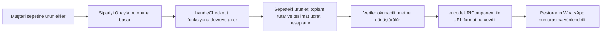

# Proje Analizi: Restoran Web Sitesi ve Sipariş Sistemi (SaaS)

Bu proje, restoranlara sadece bir "menü" değil, kurumsal kimliklerini yansıtan ve satışa odaklı bir web sitesi sunmak amacıyla tasarlanmıştır. Aşağıda bu kodun teknik yapısı, çalışma mantığı ve ticari avantajları açıklanmıştır.

---

## 1. Sistemin Temel Mantığı (Config-Driven UI)

Yazdığımız kodun en büyük özelliği, **"Konfigürasyon Tabanlı"** olmasıdır. Yani kodun kendisi (iskeleti) sabittir, ancak içindeki "Ruh" (Görseller, Yazılar, Renkler) tek bir veri kaynağından beslenir.

### Kodun İçindeki `restaurantConfig` Nesnesi

Bu nesne, sitenin beynidir. Şu an kodun en tepesinde duruyor ama gerçek senaryoda bu bir **JSON dosyası** olacak.

| Bölüm | Açıklama |
|-------|----------|
| **branding** | Restoranın adı, logosu, sloganı ve renk kodları burada tanımlı. Buradaki `bg-red-700` kodunu `bg-blue-600` yaparsan, tüm site anında bir balık restoranı temasına dönüşür. |
| **menu** | Ürünler, fiyatlar ve resimler burada listelidir. |
| **info** | Adres, telefon ve çalışma saatleri buradadır. |

> [!TIP]
> **Avantajı:** Yeni bir müşteriye (örneğin bir pizzacıya) site yapacağın zaman koda dokunmazsın. Sadece bu ayar kısmını değiştirirsin ve **5 dakikada** yeni site hazır olur.

---

## 2. Tasarım Mimarisi (Görünüm)

Kod, modern web standartlarına uygun olarak **5 ana bölüme** ayrılmıştır:

### 2.1 Navbar (Üst Menü)

- Site aşağı kaydırıldığında (`scrolled` state'i) şeffaf halden beyaz hale geçer. Bu, profesyonel bir "Landing Page" hissiyatı verir.
- Masaüstünde geniş menü, mobilde ise **"Hamburger Menü"** açılır.

### 2.2 Hero Section (Vitrin)

- Tam ekran görsel ve üzerinde restoranın sloganı bulunur.
- **"Call to Action" (Eylem Çağrısı):** "Sipariş Ver" butonu müşteriyi direkt menüye kaydırır.

### 2.3 Hakkımızda (Hikaye)

Müşteriye sadece yemek değil, bir **hikaye** sattığımız bölümdür. *"1995'ten beri..."* gibi metinlerle güven oluşturulur.

### 2.4 Menü ve Sepet (Ticaret Motoru)

- Ürünler **kategorilere** ayrılmıştır.
- Kullanıcı **"+"** butonuna bastığında ürün sanal bir sepete (`cart` state'i) eklenir.
- **Optimistic UI:** Sepete ekleme işlemi gecikmesiz, anında gerçekleşir.

### 2.5 İletişim ve Footer

Google Haritalar konumu, telefon ve sosyal medya linkleri burada yer alır.

---

## 3. Akıllı Sipariş Sistemi (WhatsApp Logic)

Bu sistemin en kritik noktası, arka planda bir veritabanı veya karmaşık bir ödeme sistemi (Stripe/Iyzico vb.) **kullanmamasıdır**.

### Nasıl Çalışır?

### Neden WhatsApp?

> [!IMPORTANT]
> Brezilya'da (ve Türkiye'de) insanlar kredi kartı bilgilerini girmektense WhatsApp'tan yazmayı tercih eder. Bu yöntem **"Sürtünmesiz (Frictionless)"** bir deneyim sunar.

---

## 4. Teknik Özellikler (Developer Gözüyle)

| Özellik | Açıklama |
|---------|----------|
| **Framework** | React (Next.js altyapısına uygun) |
| **Stil** | Tailwind CSS (CSS dosyası yazmadık, tüm stiller sınıf adları içinde) |
| **İkonlar** | `lucide-react` kütüphanesi (Hafif ve modern ikonlar) |
| **Responsive** | `md:flex`, `hidden md:block` gibi sınıflar sayesinde site hem telefonda hem bilgisayarda kusursuz görünür |
| **State Management** | React `useState` kullanılarak sepet ve menü aç/kapa durumları yönetildi |

---

## 5. Özet: Bu Kod Senin İçin Ne İfade Ediyor?

Bu kod parçası, senin **"Dijital Dükkanın"**.

Bir müşteri sana geldiğinde ona *"Sana web sitesi yapacağım"* diyorsun ama aslında ona:

> **"İçinde sipariş sistemi olan, Google'da seni öne çıkaracak, hikayeni anlatacak bir platform"** veriyorsun.

> [!NOTE]
> Bu kod **şablondur**. Sen sadece içeriği (JSON verisini) değiştirerek bunu sonsuz sayıda restorana kiralayabilirsin.